# 🎮 NPC Cognitive Architecture & Interactive RPG Framework

An immersive 2D RPG simulation where Non-Player Characters (NPCs) are driven by a local hybrid cognitive architecture integrated with custom Deep Learning models. NPCs in this village do not follow static dialog trees; instead, they possess **Episodic Memory (Chroma Vector Database)**, **Semantic Memory (SQLite Relational Facts)**, **Procedural Memory (Behavioral Adaptation)**, and live **Neural Engines (PyTorch MLP, CNN, & Autoencoder)** that dynamically evaluate relationships, trigger cognitive "surprise" alerts, and consolidate memories.

---

## 🗺️ System Overview & Gameplay

The player navigates a 2D grid-based village built with **Phaser 3**, interacting with characters in real-time. 

*   **Move:** Use `WASD` or `Arrow Keys` to walk around the village.
*   **Interact:** Approach an NPC and press `E` to open the Dialogue Overlay.
*   **Trade:** Purchase items (swords, potions, armor) using silver coins from your persistent player inventory.
*   **Live Mood Emotes:** Sprite labels dynamically display floating emotion emotes (`💚` Content, `💢` Angry, `❓` Surprised, `💬` Chatting) with custom pop scale animations in Phaser.
*   **Multi-Agent Patrol Cycles:** Sergeant Borin leaves his gate post every 25 seconds (starting 5 seconds after map load) to patrol Alaric's shop. When they meet, they trigger a 3-turn local LLM dialogue loop rendered as speech bubbles below their feet.
*   **Dev Inspect:** Press `Tab` or click the 🔧 icon in the top right to open the **Developer Panel** to view live memory states, mood scores, facts, and underlying cognitive cycles of the NPCs in real-time.

---

## 🧠 Cognitive Architecture

This framework simulates human-like conversation, emotional adaptation, and selective forgetfulness through a specialized backend pipeline that feeds into the LLM context.

```mermaid
sequenceDiagram
    autonumber
    actor Player as 🧑 Player
    participant FE as 🖥️ Frontend (React/Phaser)
    participant BE as ⚙️ Flask Backend
    participant MLP as 🧠 PyTorch MLP Classifier
    participant AE as 🔀 PyTorch Autoencoder
    participant SQL as 🗄️ SQLite (Semantic/Procedural)
    participant Chroma as 📚 ChromaDB (Episodic)
    participant LLM as 🤖 Local LLM Server
 
    Player->>FE: Move & Interact (Press 'E') / Sends Chat
    FE->>BE: POST /chat { npc_id, player_text }
    
    rect rgb(20, 30, 45)
        note right of BE: Cognitive Loop Start
        BE->>MLP: Classify intent of "player_text" (Custom PyTorch Classifier)
        MLP-->>BE: Intent: friendly / hostile / trade / quest
        
        BE->>AE: Extract sentence embedding & run reconstruction
        AE-->>BE: Surprise triggered? (MSE loss > 0.002000)
        
        BE->>SQL: Retrieve Mood score (0.0 to 1.0) & Behavioral rules
        SQL-->>BE: Mood score, rules (e.g., hostile_player -> very_short_angry)
        
        BE->>Chroma: Retrieve relevant past memories (Consolidated & Recent history)
        Chroma-->>BE: Top-N episodic dialogue history
        
        note right of BE: Formulate "Inner Monologue"<br/>(Adds confusion thoughts if surprised)
        
        BE->>BE: Construct prompt (System Prompt + Inner Monologue + Facts + Memories + Rules)
    end
 
    BE->>LLM: Send system prompt & dialogue context
    LLM-->>BE: In-character response (e.g., shopkeeper price check, reaction)
    
    rect rgb(20, 30, 45)
        note right of BE: Cognitive Loop Memory Extraction & Decay
        BE->>BE: Extract new facts from text (Regex: player name, likes, transactions)
        BE->>SQL: Store extracted facts & Update Mood (intent adjustments)
        BE->>SQL: Learn new procedural behavior rules (if mood drops/rises)
        BE->>Chroma: Embed & store conversation turn with surprise metadata (is_core)
    end
    
    BE-->>FE: Reply + Debug payload (Mood, Monologue, Facts, Intent, Surprise Score)
    FE-->>Player: Display NPC dialogue response & render Phaser emotes/bubbles
```



### The Memory Layers & Deep Learning Engines
1.  **PyTorch MLP Intent Classifier (Syllabus: CO1/CO3):** 
    *   Replaces generic classifiers to actively drive the game's intent detection. 
    *   Trained on **4,000 augmented custom RPG examples** to 100% accuracy, providing highly accurate intent classifications (`friendly`, `hostile`, `trade`, `quest`) for fantasy-themed player inputs.
2.  **PyTorch Autoencoder (Syllabus: CO4/CO5):**
    *   Maps 384-dimensional sentence transformer embeddings down to a **32-dimensional latent bottleneck** and decodes them back to 384 dimensions.
    *   Reconstruction Mean Squared Error (MSE) acts as a mathematical model of **cognitive surprise / OOD (Out-of-Distribution) detection**.
    *   Inputs scoring above `0.002000` MSE trigger **surprise behaviors**: NPCs become defensive/confused, update their inner monologues, alter their dialogue style, and drop their mood score by `0.05`.
3.  **Memory Consolidation & Selective Decay (Imperfect Memory):**
    *   Simulates human forgetfulness. Conversation turns are stored in ChromaDB with their corresponding `is_core` (surprise) flag.
    *   **Routine Decay:** Old routine dialogue turns (loss $\le 0.002000$) that fall outside the immediate context window of the last 4 turns are **decayed and forgotten** (excluded from prompt building).
    *   **Core Memories consolidate (remembering):** Older turns flagged as `is_core = True` (because they triggered high reconstruction loss / surprise) are permanently locked as **Core Memories** and will be retrieved indefinitely.
4.  **Semantic Memory (SQLite - Facts):** Tracks concrete details extracted dynamically from interactions, such as the player's name, item preferences, and transaction history.
5.  **Procedural Memory (SQLite - Behavior Rules):** Adapts how characters speak. For example, if a player is repeatedly hostile, the NPC writes a rule matching `hostile_player` to `very_short_angry`, shifting their response style.

---

## 👥 NPC Persona Profiles

The village contains four distinct characters, each defined by their own JSON configuration of personality, inventory, self-identity, and speech boundaries:

| Portrait | Name | Role | Personality Summary | Speech Style & Limits |
| :---: | :--- | :--- | :--- | :--- |
| 🧙‍♂️ | **Alaric** | Shopkeeper | Grizzled war veteran turned merchant. Speaks in short, bitter sentences. Never smiles or apologizes. | 1-2 short sentences (max 15 words). Bitter, uses military slang. Self-identifies as a grizzled shopkeeper. |
| ⚔️ | **Sergeant Borin** | Town Guard | Stern gate protector. Speaks in commands and procedural terms. Suspicious of idle vagrants but respects trade. | 1-2 brief sentences (max 18 words). Stern, direct. Self-identifies as gate protector Sergeant Borin. |
| 🗡️ | **Vexis** | Shadow Broker | Smuggler and information dealer. Speaks in half-truths, charming smiles, and implications. Never lies directly. | 2-3 sentences (max 30 words). Charming, refers to player as "friend" or "dear". Self-identifies as opportunity broker. |
| 👵 | **Elder Mira** | Village Elder | Ancient healer and seer. Has watched the forest grow for eighty winters. Speaks in riddles and proverbs. | 1-2 sentences (max 25 words). Direct answer in 1-3 words first if known, then add a nature metaphor. |

---

## 🛠️ Installation & Setup

### Prerequisites
*   **Python 3.12+** (for the Backend Server)
*   **Node.js 16+** & **npm** (for the Frontend Game)
*   **Local LLM server** (e.g., Llama.cpp, Ollama, or LM Studio) running a chat completions endpoint at `http://localhost:8085/v1/chat/completions`.

---

### 1. Backend Server Setup

Navigate to the `backend` folder:
```bash
cd backend
```

Create and activate a virtual environment:
```bash
python -m venv venv
source venv/bin/activate  # On Windows: venv\Scripts\activate
```

Install Python dependencies:
```bash
pip install -r requirements.txt
```

#### Train the Intent and Autoencoder Models
To train the PyTorch classifiers (MLP & CNN) and the PyTorch Autoencoder from scratch:
```bash
# 1. Train MLP & CNN Intent Classifiers on 4,000 augmented sentences
python train_intent.py

# 2. Train the Autoencoder on the 4,000 sentence embeddings
python train_autoencoder.py
```
*Outputs are saved to the `backend/models/` and `backend/data/` directories.*

#### Start the Flask Server
```bash
python app.py
```
The server will run on `http://localhost:5000`.

---

### 2. LLM Completion Server Setup

Ensure you have a local LLM runner (like `llama.cpp` or `LM Studio`) serving a Chat Completions API.
*   **Endpoint:** `http://localhost:8085/v1/chat/completions`
*   **Default Model:** Configured for `gemma` (can be changed in `backend/app.py` under the chat payload).

---

### 3. Frontend Web App Setup

Navigate to the `frontend` folder:
```bash
cd ../frontend
```

Install packages:
```bash
npm install
```

Start the Vite development server:
```bash
npm run dev
```
Open the local server URL (usually `http://localhost:5173`) in your web browser.

---

## 🧪 Database & Vector Store Schema

*   **Vector DB (ChromaDB):** Persistent storage located at `backend/memory/chroma_store`. Separate vector collections are kept for each NPC (`npc_alaric`, `npc_borin`, etc.) containing conversational embeddings.
*   **Relational DB (SQLite):** Database file at `backend/db.sqlite` containing:
    *   `relationships`: Mood scores (`mood_score`) and interaction counts (`interaction_count`) per NPC.
    *   `facts`: Semantic information (`fact_type`, `fact_value`, `timestamp`) mapped to each NPC.
    *   `behavior_rules`: Learned behavior modifiers (`trigger`, `response_style`) matching specific mood triggers.

---

## 🔧 Developer Controls (Live State Inspection)

Open the developer view panel using the **Tab key** or the gear icon. It provides:
1.  **NPC Status:** Current interaction counts and real-time mood progression bars (Green > 0.7, Yellow 0.35-0.7, Red < 0.35) and **Autoencoder Surprise** badges (`🔥 SURPRISED` / `👤 CALM`).
2.  **Cognitive Insights:** Displays the NPC's active "Inner Monologue" list, system prompt payload, and the specific behavior rules currently applied to their generation.
3.  **Episodic Log:** Full scrollable dialogue logs stored in ChromaDB vector memory, highlighting core consolidated memories.
4.  **Semantic Map:** The relational database facts extracted from conversations.
5.  **Master Wipes:** Clear individual NPC databases or trigger a "Master Wipe" to completely reset all SQLite and ChromaDB data for a clean gameplay run.
