# 🎮 NPC Cognitive Architecture & Interactive RPG Framework

An immersive 2D RPG simulation where Non-Player Characters (NPCs) are driven by a local hybrid cognitive architecture. NPCs in this village do not follow static dialog trees; instead, they possess **Episodic Memory (Chroma Vector Database)**, **Semantic Memory (SQLite Relational Facts)**, **Procedural Memory (Behavioral Adaptation)**, and live **Intent Classification (DistilBERT)** to dynamically evaluate relationships and formulate responses using a Large Language Model.

---

## 🗺️ System Overview & Gameplay

The player navigates a 2D grid-based village built with **Phaser 3**, interacting with characters in real-time. 

*   **Move:** Use `WASD` or `Arrow Keys` to walk around the village.
*   **Interact:** Approach an NPC and press `E` to open the Dialogue Overlay.
*   **Trade:** Purchase items (swords, potions, armor) using silver coins from your persistent player inventory.
*   **Dev Inspect:** Press `Tab` or click the 🔧 icon in the top right to open the **Developer Panel**. Inspect live memory states, mood scores, facts, and underlying cognitive cycles of the NPCs in real-time.

---

## 🧠 Cognitive Architecture

This framework simulates human-like conversation and memory persistence through a specialized backend pipeline that feeds into the LLM context.

```mermaid
sequenceDiagram
    autonumber
    actor Player as 🧑 Player
    participant FE as 🖥️ Frontend (React/Phaser)
    participant BE as ⚙️ Flask Backend
    participant Intent as 🏷️ DistilBERT Classifier
    participant SQL as 🗄️ SQLite (Semantic/Procedural)
    participant Chroma as 📚 ChromaDB (Episodic)
    participant LLM as 🤖 Local LLM Server

    Player->>FE: Move & Interact (Press 'E') / Sends Chat
    FE->>BE: POST /chat { npc_id, player_text }
    
    rect rgb(20, 30, 45)
        note right of BE: Cognitive Loop Start
        BE->>Intent: Classify intent of "player_text"
        Intent-->>BE: Intent: friendly / hostile / trade / quest
        
        BE->>SQL: Retrieve Mood score (0.0 to 1.0) & Behavioral rules
        SQL-->>BE: Mood score, rules (e.g., hostile_player -> very_short_angry)
        
        BE->>Chroma: Retrieve relevant past memories (Vector Embedding query)
        Chroma-->>BE: Top-N episodic dialogue history
        
        note right of BE: Formulate "Inner Monologue"<br/>(NPC emotional reaction)
        
        BE->>BE: Construct prompt (System Prompt + Inner Monologue + Facts + Memories + Rules)
    end

    BE->>LLM: Send system prompt & dialogue context
    LLM-->>BE: In-character response (e.g., shopkeeper price check, reaction)
    
    rect rgb(20, 30, 45)
        note right of BE: Cognitive Loop Memory Extraction
        BE->>BE: Extract new facts from text (Regex: player name, likes, transactions)
        BE->>SQL: Store extracted facts & Update Mood (intent adjustments)
        BE->>SQL: Learn new procedural behavior rules (if mood drops/rises)
        BE->>Chroma: Embed & store conversation turn
    end
    
    BE-->>FE: Reply + Debug payload (Mood, Monologue, Facts, Intent)
    FE-->>Player: Display NPC dialogue response & update Dev Panel
```



### The Three Memory Layers
1.  **Episodic Memory (ChromaDB + Sentence Transformers):** Captures the natural history of the player's conversation with the NPC. Turns are encoded into high-dimensional vector representations using `all-MiniLM-L6-v2` and stored. Relevant turns are retrieved semantically to provide contextual continuity.
2.  **Semantic Memory (SQLite - Facts):** Tracks concrete details extracted dynamically from interactions, such as the player's name, item preferences, and transaction history.
3.  **Procedural Memory (SQLite - Behavior Rules):** Adapts how characters speak. For example, if a player is repeatedly hostile, the NPC writes a rule matching `hostile_player` to `very_short_angry`, shifting their response style.

---

## 👥 NPC Persona Profiles

The village contains four distinct characters, each defined by their own JSON configuration of personality, inventory, and speech boundaries:

| Portrait | Name | Role | Personality Summary | Speech Style & Limits |
| :---: | :--- | :--- | :--- | :--- |
| 🧙‍♂️ | **Alaric** | Shopkeeper | Grizzled war veteran turned merchant. Speaks in short, bitter sentences. Never smiles or apologizes. Sells weapons & items. | 1-2 short sentences (max 15 words). Bitter, uses military slang. State prices directly. |
| ⚔️ | **Sergeant Borin** | Town Guard | Suspicions of strangers but loyal to allies. Speaks in commands and procedural terms. Checks weapons at the gate. | 1 short command or question (max 12 words). Stern, direct, zero small talk. |
| 🗡️ | **Vexis** | Shadow Broker | Smuggler and information dealer. Speaks in half-truths, charming smiles, and implications. Never lies directly. | 2-3 sentences (max 30 words). Charming, refers to player as "friend" or "dear". |
| 👵 | **Elder Mira** | Village Elder | Ancient healer and seer. Speaks in riddles, proverbs, and nature metaphors. Offers wisdom instead of goods. | 1-2 sentences (max 25 words). Direct answer in 1-3 words first if known, then add a nature metaphor. |

---

## 🛠️ Installation & Setup

### Prerequisites
*   **Python 3.8+** (for the Backend Server)
*   **Node.js 16+** & **npm** (for the Frontend Game)
*   **Local LLM server** (e.g., Llama.cpp, Ollama, or LM Studio) running a chat completions endpoint at `http://localhost:8085/v1/chat/completions`.

---

### 1. Backend Server Setup

Navigate to the `backend` folder:
```bash
cd backend
```

Create and activate a virtual environment:
```bash
python3 -m venv venv
source venv/bin/activate  # On Windows: venv\Scripts\activate
```

Install Python dependencies:
```bash
pip install -r requirements.txt
```
*(Dependencies include `Flask`, `flask-cors`, `chromadb`, `sentence-transformers`, `torch`, `transformers`, and `requests`)*

#### Initialize & Train Intent Classifier (Optional)
The backend requires the Hugging Face DistilBERT intent classifier files to be present in `backend/lstm/distilbert_intent`. If not pre-trained, run the training script:
```bash
python lstm/train_distilbert.py
```
This trains the sequence classification model on `lstm/data.csv` to recognize `friendly`, `hostile`, `trade`, and `quest` intents.

#### Start the Flask Server
```bash
python app.py
```
The server will run on `http://localhost:5000`.

---

### 2. LLM Completion Server Setup

Ensure you have a local LLM runner (like `llama.cpp` or `LM Studio`) serving a Chat Completions API.
*   **Endpoint:** `http://localhost:8085/v1/chat/completions`
*   **Default Model:** Configured for `gemma` (can be changed in `backend/app.py` under the chat payload).

---

### 3. Frontend Web App Setup

Navigate to the `frontend` folder:
```bash
cd ../frontend
```

Install packages:
```bash
npm install
```

Start the Vite development server:
```bash
npm run dev
```
Open the local server URL (usually `http://localhost:5173`) in your web browser.

---

## 🧪 Database & Vector Store Schema

*   **Vector DB (ChromaDB):** Persistent storage located at `backend/memory/chroma_store`. Separate vector collections are kept for each NPC (`npc_alaric`, `npc_borin`, etc.) containing conversational embeddings.
*   **Relational DB (SQLite):** Database file at `backend/db.sqlite` containing:
    *   `relationships`: Mood scores (`mood_score`) and interaction counts (`interaction_count`) per NPC.
    *   `facts`: Semantic information (`fact_type`, `fact_value`, `timestamp`) mapped to each NPC.
    *   `behavior_rules`: Learned behavior modifiers (`trigger`, `response_style`) matching specific mood triggers.

---

## 🔧 Developer Controls (Live State Inspection)

Open the developer view panel using the **Tab key** or the gear icon. It provides:
1.  **NPC Status:** Current interaction counts and real-time mood progression bars (Green > 0.6, Yellow 0.3-0.6, Red < 0.3).
2.  **Cognitive Insights:** Displays the NPC's active "Inner Monologue" list, system prompt payload, and the specific behavior rules currently applied to their generation.
3.  **Episodic Log:** Full scrollable dialogue logs stored in ChromaDB vector memory.
4.  **Semantic Map:** The relational database facts extracted from conversations.
5.  **Master Wipes:** Clear individual NPC databases or trigger a "Master Wipe" to completely reset all SQLite and ChromaDB data for a clean gameplay run.
